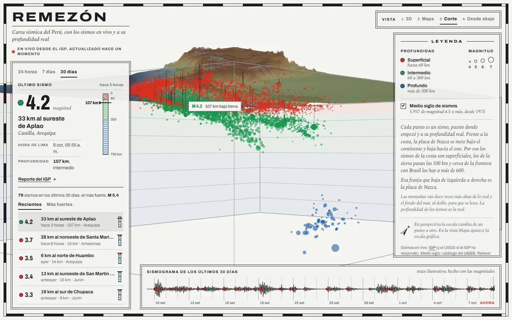
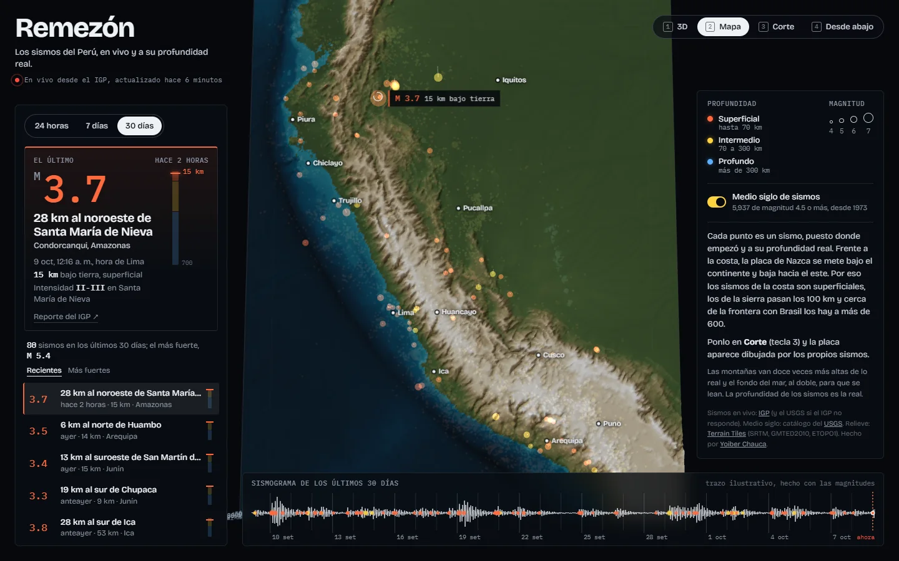
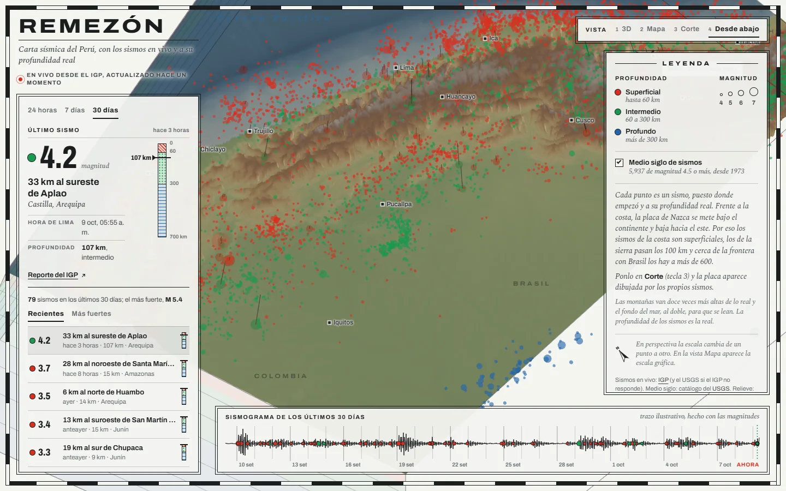
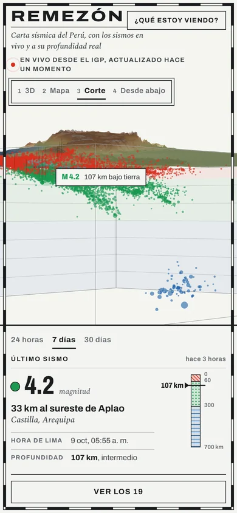

# Remezón

Los sismos del Perú en vivo y en 3D, cada uno a la profundidad donde empezó. Los datos son los
reportes del IGP (Instituto Geofísico del Perú) y la página los vuelve a pedir cada minuto.

**En vivo: [sismos.yoiber.dev](https://sismos.yoiber.dev)**



## Qué se ve

Debajo del relieve del Perú hay una caja de 700 km de hondo. Cada punto es un sismo puesto en su
hipocentro, el punto donde se rompió la roca. El color dice a qué profundidad: naranja hasta 70 km,
amarillo hasta 300 y azul más abajo. El tamaño crece con la magnitud.

Los sismos del período elegido (24 horas, 7 días o 30 días) van más grandes, con una línea que baja
desde el epicentro, y se ven a través del suelo. Detrás quedan los 5 937 sismos de magnitud 4.5 o más
que registró el USGS desde 1973.

Mirados de costado, en la vista **Corte**, esos sismos dibujan la placa de Nazca. La placa entra bajo
la costa, baja por debajo de los Andes y sigue hasta pasar los 600 km de hondo cerca de la frontera
con Brasil. La cámara de esa vista mira a lo largo de la costa, de sureste a noroeste, así que los
sismos de todo el país caen en un mismo perfil.

Hay cuatro vistas: 3D, Mapa, Corte y Desde abajo (teclas 1 a 4). Si tocas un sismo en la lista, en el
sismograma de abajo o en la escena, la cámara va hasta él; Esc lo suelta. La ficha dice la magnitud,
dónde fue, a qué hora de Lima, a qué profundidad y con qué intensidad se sintió.

| Mapa | Desde abajo | Celular |
| --- | --- | --- |
|  |  |  |

## De dónde salen los datos

| Qué | Fuente | Dónde se arma |
| --- | --- | --- |
| Los sismos en vivo | [IGP](https://ultimosismo.igp.gob.pe/), y el [USGS](https://earthquake.usgs.gov/) si el IGP no responde | `server/utils/fuentes.ts` |
| Medio siglo de sismos | Catálogo del USGS (FDSN), magnitud 4.5 o más desde 1973 | `scripts/datos.py` → `public/datos/historicos.json` |
| El relieve y el fondo del mar | [Terrain Tiles](https://registry.opendata.aws/terrain-tiles/) de AWS Open Data (SRTM, GMTED2010, ETOPO1) | `scripts/datos.py` → `public/datos/relieve.bin` |

El IGP no tiene una API documentada. Su página de sismos reportados lee una lista por año, y el
servidor de Remezón pide esa misma lista, la guarda tres minutos y le pasa al navegador solo los del
período. Así el IGP recibe a lo más una consulta cada tres minutos, aunque haya mil personas mirando.
El detalle está en [docs/como-funciona.md](docs/como-funciona.md).

## Cómo está hecho

- [Nuxt 4](https://nuxt.com) (Vue 3 y TypeScript). La página se arma en el navegador; el servidor de
  Nuxt (Nitro) solo atiende `/api/sismos` y guarda cada respuesta un minuto.
- [TresJS](https://tresjs.org), que lleva three.js a componentes de Vue, y sus extras
  (`@tresjs/cientos`) para la cámara y los rótulos en HTML.
- Una unidad de la escena son 100 km. La profundidad de los sismos va a escala real; las montañas van
  doce veces más altas y el fondo del mar, al doble, porque a escala real los Andes serían una lámina.
- Sin librerías de interfaz: los paneles, el sismograma y la columna de profundidad son SVG y CSS.

```
app/
  app.vue              la escena a pantalla completa y los paneles encima
  components/          Escena, Relieve, Caja, PuntosHistoricos, PuntosVivos, Ciudades, Encuadre,
                       Panel, FichaSismo, Hondura, Sismograma, Vistas, Leyenda
  composables/         el estado compartido, el relieve y los formatos
server/
  api/sismos.get.ts    GET /api/sismos?periodo=dia|semana|mes
  utils/               el IGP, el USGS y la traducción de los lugares del USGS
shared/zona.ts         la zona del mapa y el paso de grados y kilómetros a la escena
scripts/datos.py       baja el relieve y el catálogo histórico
```

## Correrlo

Con Node 24 o más:

```bash
npm install
npm run dev
```

Queda en `http://localhost:5182`. Los datos fijos ya vienen en `public/datos`. Para volver a
generarlos hace falta Python 3 con Pillow:

```bash
npm run datos
```

## Publicarlo

```bash
docker build -t remezon .
docker run -p 3000:3000 remezon
```

El `Dockerfile` construye con Node y deja solo la salida de Nuxt (`.output`), que corre con
`node .output/server/index.mjs`. No necesita claves ni variables de entorno.

## In English

Remezón («strong tremor» in Peruvian Spanish) shows Peru's earthquakes live and in 3D, each one at the
depth where it started. It is built with Nuxt 4, Vue 3 and TresJS (three.js for Vue). Live data comes
from the reports of Peru's Geophysical Institute (IGP), with the USGS as a fallback, through a small
Nitro endpoint that caches upstream requests. Under the terrain there is a 700 km deep box with the
5,937 USGS earthquakes of magnitude 4.5+ since 1973; seen from the side, they trace the Nazca plate
diving under South America. The app and docs are in Spanish.
